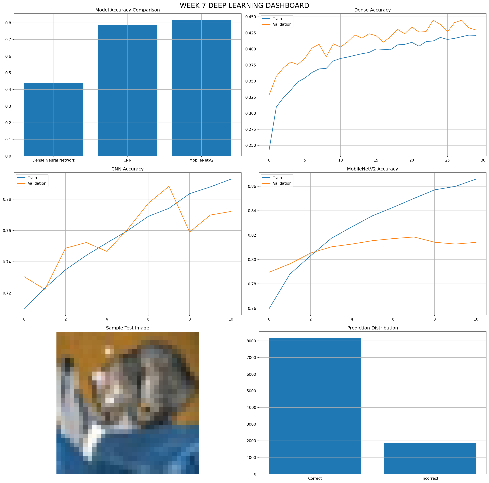

# AI/ML Internship — Week 7

## Author
Mirza Qasim

## Project Title
Deep Learning for Image Classification using CNNs and Transfer Learning

---

## Dataset
CIFAR-10 Dataset

The CIFAR-10 dataset contains 60,000 color images belonging to 10 different object categories:

- Airplane
- Automobile
- Bird
- Cat
- Deer
- Dog
- Frog
- Horse
- Ship
- Truck

The dataset is automatically loaded using TensorFlow/Keras and is widely used for image classification tasks.

---

## Objectives

- Understand image classification using Deep Learning
- Build a baseline Dense Neural Network
- Develop a Convolutional Neural Network (CNN) from scratch
- Apply Transfer Learning using MobileNetV2
- Compare multiple deep learning architectures
- Evaluate model performance using classification metrics
- Perform error analysis and model comparison
- Create a complete deep learning evaluation dashboard

---

## Models Implemented

### 🔹 Dense Neural Network (Baseline)

- Flattened image input
- Fully connected layers
- ReLU activation
- Dropout regularization
- Softmax output layer

### 🔹 Convolutional Neural Network (CNN)

- Convolutional Layers
- Max Pooling Layers
- Batch Normalization
- Dropout Layers
- Dense Classification Head

### 🔹 Transfer Learning (MobileNetV2)

- Pretrained ImageNet weights
- Frozen feature extraction layers
- Global Average Pooling
- Custom classification layers
- Fine-tuned image classification pipeline

---

## Key Tasks Performed

### 🔹 Data Exploration

- Dataset loading
- Class distribution analysis
- Sample image visualization
- Pixel statistics analysis

### 🔹 Data Preprocessing

- Image normalization
- One-hot encoding
- Data preparation for deep learning models

### 🔹 Data Augmentation

Applied:
- Rotation
- Horizontal Flip
- Width Shift
- Height Shift

to improve model generalization.

### 🔹 Baseline Neural Network

Performed:
- Model design
- Training
- Validation
- Performance evaluation

### 🔹 CNN Development

Performed:
- Feature extraction using convolution layers
- Pooling operations
- Batch normalization
- Regularization using dropout

### 🔹 Transfer Learning

Implemented:
- MobileNetV2 pretrained network
- Feature extraction
- Transfer learning workflow
- Model comparison

### 🔹 Model Evaluation

Computed:
- Accuracy
- Classification Report
- Confusion Matrix
- Training Curves
- Validation Curves

### 🔹 Error Analysis

Performed:
- Misclassified image analysis
- Prediction inspection
- Visual error examination

### 🔹 Model Comparison

Compared:
- Dense Neural Network
- CNN
- MobileNetV2

using classification accuracy and performance metrics.

---

## Key Insights

- CNN significantly outperformed the Dense Neural Network.
- Transfer Learning achieved the best overall performance.
- Convolutional layers effectively learned image features.
- MobileNetV2 benefited from pretrained ImageNet knowledge.
- Data augmentation improved model robustness and generalization.
- Deep learning architectures are highly effective for image classification tasks.

---

## Dashboard

### Deep Learning Evaluation Dashboard

---

## Files Included

- week7_deep_learning.ipynb
- week7_dashboard.png
- week7_best_model.keras
- README.md

---

## Tools & Libraries

- Python
- TensorFlow
- Keras
- NumPy
- Pandas
- Matplotlib
- Seaborn
- Scikit-learn

---

## Conclusion

This project demonstrates a complete Deep Learning workflow for image classification using the CIFAR-10 dataset. Multiple neural network architectures were implemented, trained, evaluated, and compared. The project highlights the advantages of CNNs and Transfer Learning over traditional dense neural networks for computer vision tasks. The final model achieved strong classification performance and provided valuable insights into modern image recognition techniques.
